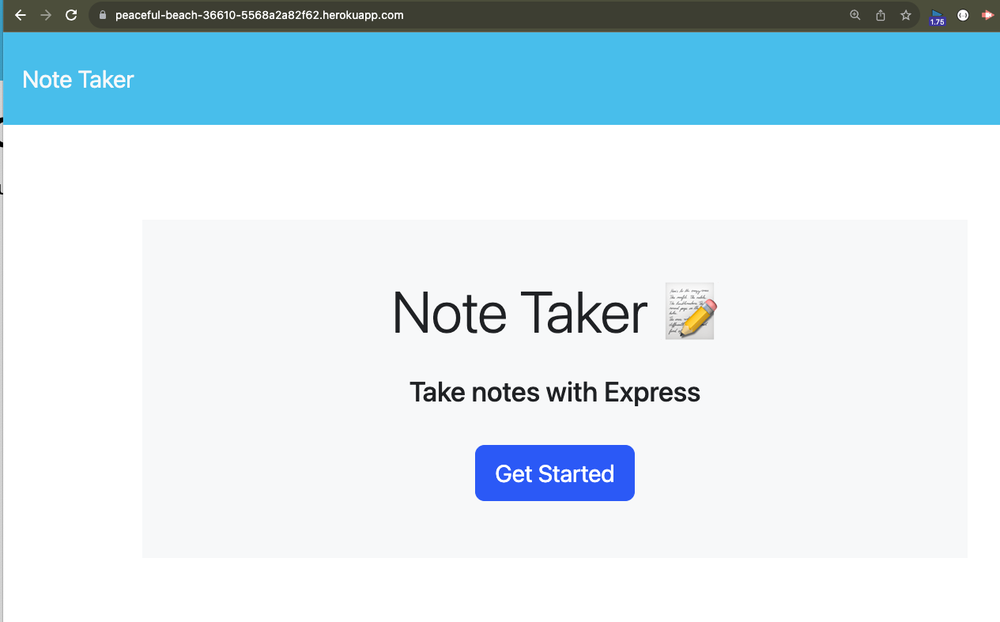
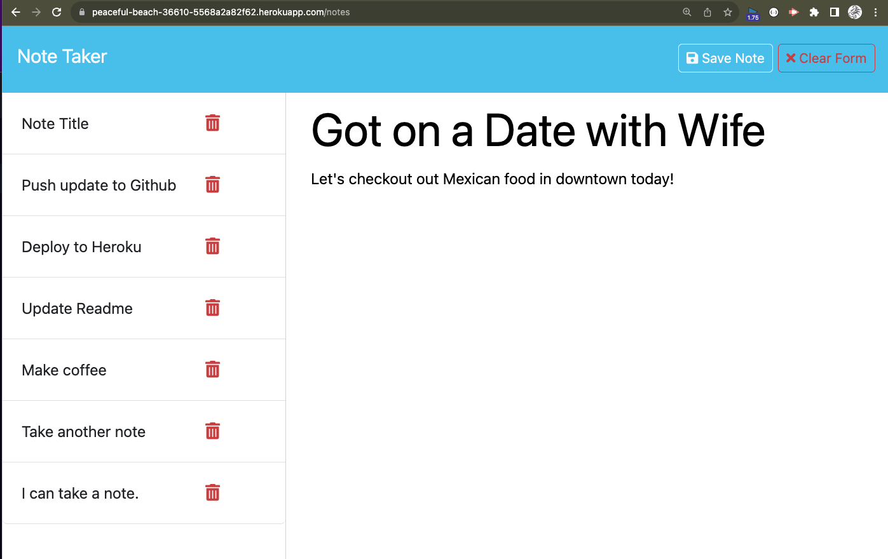

# note-taker
This is an application that can be used to write and save notes.

## Description and Motivation
This application is created to allow a user to create notes for themself. Little reminders that can be viewed at any time (like a TODO list). When done with the note, then you can delete it.

It should looks something like this:



It is built with the understanding that a user just might need a simple place to make and store notes. 


## Usage

This application is deployed to Heroku. It is an interactive site that you only need to start taking notes and then you will see them show up to the right of the page. Though not necessary at this time, the delete button does not work. I will work on that shortly.

Here is the link to the Deployed Application ...
[Note Taker Deployed on Heroku](https://peaceful-beach-36610-5568a2a82f62.herokuapp.com/)


## Table of Contents

* [Technology Used](#technology-used)
* [Repo Location](#repo)
* [Screenshots of Application](screenshots-of-application)
* [Learning Points](#learning-points)
* [Code Snippets](#code-snippets)
* [Contact Info](#contact-info)

## Technology Used 

| Technology Used         | Resource URL           | 
| ------------- |:-------------:| 
| Heroku | [https://www.heroku.com//](https://www.heroku.com/)     |    
| Git | [https://git-scm.com/](https://git-scm.com/)     |    
| NPM and ExpressJs | [https://www.npmjs.com/package/express](https://www.npmjs.com/package/express)|
| NodeJs | [https://nodejs.org/en](https://nodejs.org/en)|
| ChatGPT | [https://openai.com/blog/chatgpt](https://openai.com/blog/chatgpt)|

There is also javascript, Google Search, and Youtube university. 
## Repo 

[GitHub Repo for Note-Taker](https://github.com/flimits/note-taker)


## Screenshots of Application
---
To get a better picture of what it is doing, or going to do, here are three snapshots to look at.

### Here is the opening page.

---
---
### This one is creating a new Note (notice it is not in the notes yet)

---
---
### Then finally the note is stored in the database after you select save.

---


## Learning Points 

Thought the assignment ended up not being too difficult, it was a good exploration in expressjs and route and port assignment. I needed to read, re-watch some of the videos from school, youtube, and a ton of examples in order to finally see what I was missing. This type of stuff will be fun once copletely understood.

### Somee lessons a little more painful to add on it

It took me forever to get Heroku login. I suggest doing it as soon as humanly possible. Also had to wait for logins to be completed on Heroku's side before proceeding to get rights to publishing functionality. Other than that, it is a good platform to publish code (that is not html-only).

Another one was understanding how expressjs handles routing. this took a long time to understand, and takes a lot of playing around and reading on it. Once this is down, it will be super cool to keep playing with it.

AskBcs, Chatgpt and Google helped a lot.

## Code Snippets

There are two main parts to this setup from my point of view 
1 setup of the expressjs server and
2 setting up the ability of the server to update a file with a new note.


- This is the beginning setup of the ExpressJs server.
```js
const express = require('express');
const path = require('path');
const fs = require('fs');
const PORT = process.env.port || 3001;

const app = express();
const db = require('./db/db.json');

app.use(express.static('public'));
app.use(express.json());
app.use(express.urlencoded({ extended: true }));
```

- Here is the code the will write the data to the notes db file. It basically take the note that was just created on the web page and then updates the notes database file with it by first reading in the whole file, then appending to the end of it. 
```js
    // Get current notes to parse them.
    fs.readFile('./db/db.json', 'utf8', (err, data) => {
        if (err) {
            console.error(err);
        } else {
            const notesDb = JSON.parse(data);

            // Let's add a new note
            notesDb.push(newNote);

            db.push(newNote);

            // Update the note db with latest note added.
            fs.writeFile(
                './db/db.json',
                JSON.stringify(notesDb, null, 4),
                (writeErr) =>
                    writeErr
                        ? console.error(writeErr)
                        : console.info('Successfully updated note!')
            );
        }
    });
    ```
---
### Using the require statement in node.js

The fist part of the application was to learn to require packages and libraries to run it. It will not run without them.
// Include packages needed for this application
const fs = require("fs");
const inquirer = require('inquirer');
Used test wisth jest


## Contact Info

| Name      |Email      | Github    | Portfolio |
|-----------|-----------|-----------|-----------|
|Jason       |flimits@gmail.com|https://github.com/flimits|https://github.com/flimits/my-portfolio/|


## Psuedo Code

The below was a psuedo coding exercise I did with others in order to come up with an attack plan of our to build the final touches on the Note-Taker application. 

### From the course story of what is required

* GIVEN a note-taking application
* WHEN I open the Note Taker
* THEN I am presented with a landing page with a link to a notes page
* WHEN I click on the link to the notes page
* THEN I am presented with a page with existing notes listed in the left-hand column, plus empty fields to enter a new note title and the note's text in the right-hand column
* WHEN I enter a new note title and the note's text
* THEN a "Save Note" button and a "Clear Form" button appear in the navigation at the top of the page
* WHEN I click on the Save button
* THEN the new note I have entered is saved and appears in the left-hand column with the other existing notes and the buttons in the navigation disappear
* WHEN I click on an existing note in the list in the left-hand column
* THEN that note appears in the right-hand column and a "New Note" button appears in the navigation
* WHEN I click on the "New Note" button in the navigation at the top of the page
* THEN I am presented with empty fields to enter a new note title and the note's text in the right-hand column and the button disappears

### Psuedo code part

* import express module to our server
* import require("./db/db.json")
* create app variable pointing to new express object(express())
* app.use(*middleware*){ -json, urlencoded, staticify(public)}
* 
* get/delete/post requests:
* 
* get request to send index.html, route: '/'
* get request to send notes.html, route: '/notes'
* 
* get request to fetch our api to send notes from db.json, route: '/api/notes'
* post request to fetch our api to modify with parsed req.body data and push post to db.json with fs.writeFile, route: '/api/notes', return res.json;
* delete request to delete specific note, *EXTRA CRED* remove specific data from db.json and push with fs.writeFile,  route: '/api/notes/:notes_id', return res.json;
* app.listen